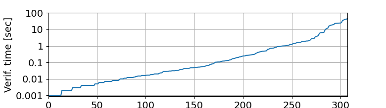

# VeriMM ASPLOS Artifact


This repository contains the artifact oft the ASPLOS'26 paper "*Managing Hardware Complexity in OS Verification*".

## Citation

```
Managing Hardware Complexity in OS Verification.
Anonymous Authors of Paper #409. ASPLOS '26.
```
The citation will be updated once the paper is accepted.


## Supported Platforms

The artifact is designed and tested to run on an x86-64 server running Ubuntu 24.04 LTS with root privileges.
Other platforms or architectures might work too, but are not tested.

Moreover, the server machine must be configured to use 4-level paging, no page table isolation, and
no indirect branch targets. You can achieve thi susing the following kernel commandline parameters:
```
nopti ibt=off no5lvl
```

## Preparation

Follow the following preparation steps to set up the machine for building and running the artifact.

**0. Ensure Root Privileges**

Either run `su root` and execute everything as the root user, or setup password less root for
your user to install kernel modules via modifying the sudoers file, add a line like this:
`$USER ALL=(ALL) NOPASSWD:ALL`


**1. Install Dependencies**

On Ubuntu, execute the following command to install the dependencies.

```bash
sudo apt-get update

sudo apt-get install linux-headers-$(uname -r) build-essential dkms libncurses-dev flex bison \
                     openssl libssl-dev libelf-dev libudev-dev libpci-dev libiberty-dev autoconf \
                     git curl unzip python3 python3-matplotlib automake libtool pkg-config libevent-dev \
                    autotools-dev
```
Note: This includes the build-dependencies of the Linux kernel modules.


**2. Install Rust**

Follow the instructions on [Rustup.rs](https://rustup.rs/) to install Rust. In short, this is:

```bash
curl --proto '=https' --tlsv1.2 -sSf https://sh.rustup.rs | sh
source $HOME/.cargo/env
```

Note: it's best to add `source $HOME/.cargo/env` to your `.bashrc`/`.zshrc`/... file so it gets
automatically sourced.

Then activate the nightly toolchain and install the sources for the standard library.

```bash
rustup override set nightly
rustup component add rust-src --toolchain nightly-x86_64-unknown-linux-gnu
```

**3. Install Verus**

Run the following command to install Verus in the right directory. You can learn more about
installing Verus from its [install instructions](https://github.com/verus-lang/verus/blob/main/INSTALL.md).

```bash
bash tools/update-verus.sh
```


**Congratulations:** you now have finished the preparation steps and you can now build and run the
artifact.

## Verification of the Hardware Model, Implementation and Refinement.

**Claim**

The proof artifacts in this repository successfully verify the two main theorems (stated in `theorem.rs`):
* The Rust implementation refines the OS+HW state machine
* The OS+HW state machine refines the hlspec

**Running the Experiment**

```bash
bash tools/verify.sh
```

**Expected Duration**

Less than one minute on an Intel Xeon Silver 4310 CPU @ 2.10GHz.

**Expected Results**
The output should look similar to the following, stating the verification results in the end with
0 errors.

```
+ verus --version
Verus
  Version: 0.2025.06.14.9b557d7.dirty
  Profile: release
  Platform: linux_x86_64
  Toolchain: 1.85.1-x86_64-unknown-linux-gnu

+ verus --crate-type=lib --rlimit 50 --cfg 'feature="impl"' --time page-table/src/lib.rs
Some checks are taking longer than 2s (diagnostics for these may be reported out of order)
• page-table/src/impl_u/l2_impl.rs:41:1: 41:122 has finished in 3s

...[cut output]...

verification results:: 518 verified, 0 errors
```

Note, there might be a missing linebreak in the Verus output before "verification results"


## Proof Metrics: Specification Size

**Claim**

The line counts match what we report in the paper.


**Running the Experiment**

```bash
bash tools/get-line-count.sh
```

**Expected Duration**

A few seconds on an Intel Xeon Silver 4310 CPU @ 2.10GHz.

**Expected Results**

The output should look like the following table:
```
| file                      | Trusted | Spec | Proof | Exec | Proof+Exec | Comment | Layout | unaccounted | Directives |
|---------------------------|---------|------|-------|------|------------|---------|--------|-------------|------------|
| lib.rs                    |       0 |    0 |     0 |    0 |          0 |      16 |     12 |          78 |          0 |
| impl_u/mod.rs             |       0 |    0 |     0 |    0 |          0 |       2 |      0 |          11 |          0 |
| impl_u/l1.rs              |       0 |  355 |   240 |    9 |          0 |    1295 |    138 |         102 |          2 |
| impl_u/l2_impl.rs         |       0 |  777 |  1492 |  159 |         39 |     236 |    396 |         126 |          9 |
| impl_u/indexing.rs        |       0 |   35 |   102 |    0 |          0 |      34 |     19 |          13 |          0 |
| impl_u/wrapped_token.rs   |       0 |  363 |  1032 |   50 |         32 |      55 |    213 |          76 |          8 |
| impl_u/verified_impl.rs   |       0 |    0 |   126 |   24 |          7 |       1 |     39 |          29 |          0 |
| impl_u/os_refinement.rs   |       0 |  387 |  1779 |    0 |          0 |     124 |    431 |          75 |          6 |
| definitions_u.rs          |       0 |   69 |    78 |   20 |          0 |      26 |     41 |          45 |          2 |
| spec_t/mod.rs             |       0 |    0 |     0 |    0 |          0 |       0 |      0 |           6 |          0 |
| spec_t/hlspec.rs          |     287 |    0 |     0 |    0 |          0 |      42 |     69 |          51 |          0 |
| spec_t/os.rs              |       0 |  978 |     0 |   43 |          0 |     151 |    211 |         152 |          2 |
| spec_t/os_ext.rs          |     294 |    0 |     0 |    0 |          0 |     110 |     90 |         111 |          0 |
| spec_t/os_code_vc.rs      |     131 |  181 |   117 |    0 |          0 |      58 |     31 |          56 |          0 |
| spec_t/os_invariant.rs    |       0 |  193 |  1589 |    0 |          0 |     101 |    220 |          54 |         13 |
| spec_t/mmu/mod.rs         |      79 |    0 |     0 |    0 |          0 |      26 |     18 |          49 |          0 |
| extra.rs                  |       0 |   59 |    94 |    0 |          0 |       4 |     34 |          35 |         11 |
| theorem.rs                |      42 |    0 |     4 |    0 |          0 |      13 |     11 |          32 |          0 |
| spec_t/mmu/rl1.rs         |       0 |  222 |     0 |   24 |          0 |      44 |     59 |          47 |          0 |
| spec_t/mmu/rl2.rs         |       0 |  937 |  1058 |   29 |          0 |     171 |    309 |         166 |         19 |
| spec_t/mmu/rl3.rs         |     513 |   85 |    90 |    0 |          0 |     102 |    145 |         133 |          9 |
| spec_t/mmu/pt_mem.rs      |      64 |   43 |    49 |    0 |          0 |      87 |     41 |          34 |          0 |
| spec_t/mmu/translation.rs |     146 |   23 |    55 |    0 |          0 |      72 |     35 |          61 |          4 |
| spec_t/mmu/defs.rs        |     233 |    6 |     6 |    0 |          0 |      21 |     80 |         102 |          2 |
|---------------------------|---------|------|-------|------|------------|---------|--------|-------------|------------|
| total                     |    1789 | 4713 |  7911 |  358 |         78 |    2791 |   2642 |        1644 |         87 |
```

The numbers should match the ones stated in the paper:

Total Lines of Code: 15k lines of code and proofs (sum of Trusted, Spec, Proof, Exec, Proof+Exec). Of which:
 * ~12.75k lines are proof script (sum of spec + proof)
 * 436 lines of executable code.
 * ~350 lines of user-space spec (spec_t/hlspec.rs and some definitions in other files)
 * ~5k lines of proofs to connect OS+HW to Userspace-spec (sum of spec and proof counts of `impl_u/os_invariant.rs`, `spec_t/os.rs`, `impl_u/os_refinement.rs`)
 * ~5k lines of refinement proofs to connect the implementation to OS+HW (sum of spec and proof counts of `impl_u/l1.rs`, `impl_u/l2_impl.rs`, `impl_u/indexing.rs`, `impl_u/wrapped_token.rs`, `impl_u/verified_impl.rs`, `spec_t/os_code_vc.rs)`
 * ~2.5k lines of LowHM simplification proofs (spec_t/mmu/rl{1,2,3}.rs + spec_t/mmu/pt_mem.rs + spec_t/mmu/translation.rs + spec_t/mmu/defs.rs)
 * ~1k lines of LowHM specification (spec_t/mmu/rl3.rs)
 * ~400 lines of additional definitions.


## Proof Metrics: Verification Time

**Claim**

The Project verifies in in reasonable time with most functions verifying in a few seconds.

**Running the Experiment**

```bash
bash tools/measure-verification-times.sh
```

**Expected Duration**

Less than one minute on an Intel Xeon Silver 4310 CPU @ 2.10GHz.

**Expected Results**

The script will generate a JSON file named `verification-times-<GIT_HASH>.json`
containing the the detailed verification times for each function. Additionally, it creates a plot
`verification-times-<GIT_HASH>.png` that should look similar to the following:
. Showing that 83% of all functions
verify in less than one second.

Note, those numbers are for an Intel Xeon Silver 4310 CPU @ 2.10GHz. The verification times may
differ depending on the CPU used.


## Performance Evaluation: Page Table Traversal (Table 2)

**Claim**

The verified page table code is has comparable performance to the unverified Linux code, and the
synthesized Velosiraptor code.

**Running the Experiment**

This experiment is automated via the following command.

```bash
cd microbenchmarks
rustup override set nightly
cargo run --bin page_table_traversal
```

Note building might fail if you haven't enabled nightly toolchain, or having a dirty git repository.
(See installing Rust above, and pass the `--allow-dirty` flag)

**Expected Duration**

The expected duration is less than one minute on an Intel Xeon Silver 4310 CPU @ 2.10GHz.

**Expected Results**
The script will produce a latex table below with the following expected results:

 * For `map`, the latencies should closely match between all implementations.
 * For `protect` VeriMM is expected to be slightly slower, due to the implementation as `unmap+map`
 * For unmap, VeriMM with reclamation is expected to be slower as it checks for empty directories,
but the `NoReclaim` variant should match Linux and Velosiratpor.

```
% ==================================================================================================
% Table: Generated Code Performance
% ==================================================================================================
% Git Hash:   74a373a
% CPU:        Intel(R) Xeon(R) Silver 4310 CPU @ 2.10GHz
% OS:         Linux 24.04 Ubuntu
% Date:       2025-12-15 12:35:29.048831547 -08:00
% ==================================================================================================
%
\begin{tabular}{crrrrrr}
  \hline % -----------------------------------------------------------------------------------------
  \th{Operation    } & \span{\th{  Map  }} & \span{\th{Protect}} & \span{\th{ Unmap }} \\
  \th{Code         } & \th{P50} & \th{P99} & \th{P50} & \th{P99} & \th{P50} & \th{P99} \\
  \hline % -----------------------------------------------------------------------------------------
  Linux              &     26ns &     29ns &     24ns &     24ns &     24ns &     24ns \\
  Velosiraptor       &     25ns &     25ns &     24ns &     24ns &     24ns &     24ns \\
  VeriMM             &     26ns &     26ns &     55ns &     57ns &    198ns &    347ns \\
  VeriMM+NoReclaim   &     19ns &     20ns &     29ns &     30ns &     17ns &     17ns \\
  \hline % -----------------------------------------------------------------------------------------
\end{tabular}
%
% ==================================================================================================
```


## Performance Evaluation: System Call Performance (Table 3)

**Claim**

The verified code can be integrated into an operating system, correctly maps and unmaps memory of a
process with comparable performance to standard Linux and Velosiraptor code.

**Running the Experiment**

This experiment is automated via the following command.
**Note**: you need *root* privileges to run this experiment.

```bash
cd microbenchmarks
rustup override set nightly
cargo run --bin systemcall_map_unmap
```

Note building might fail if you haven't enabled nightly toolchain, or having a dirty git repository.
(See installing Rust above, and pass the `--allow-dirty` flag)


**Expected Duration**

The expected duration is less than one minute on an Intel Xeon Silver 4310 CPU @ 2.10GHz.

**Expected Results**

The script will print a latex table with the expected results as shown below.
For all operations (`map`, `protect`, `unmap`), the four configurations should have roughly comparable
results, where Linux is expected to be slightly slower due to additional VMA management overhead.

```
% =====================================================================================================
% Table: System Call Performance
% =====================================================================================================
% Git Hash:   f17e641
% CPU:        Intel(R) Xeon(R) Silver 4310 CPU @ 2.10GHz
% OS:         Linux 24.04 Ubuntu
% Date:       2025-12-15 12:41:56.154109259 -08:00
% =====================================================================================================
%
\begin{tabular}{ccrrrrrr}
  \hline % --------------------------------------------------------------------------------------------
  \th{Operation      } & \span{\th{  Map  }} & \span{\th{Protect}} & \span{\th{ Unmap }} \\
  \th{Code           } & \th{P50} & \th{P99} & \th{P50} & \th{P99} & \th{P50} & \th{P99} \\
  \hline % --------------------------------------------------------------------------------------------
  Linux                &   3208ns &   3559ns &   7922ns &   9583ns &  10607ns &  11534ns \\
  Velosiraptor         &   1406ns &   1698ns &   7770ns &   8031ns &   7678ns &   7848ns \\
  VeriMM               &   1464ns &   1746ns &   7107ns &   7366ns &   7623ns &   9348ns \\
  VeriMM+NoReclaim     &   1645ns &   2075ns &   6450ns &   6838ns &   6323ns &   6701ns \\
  \hline % --------------------------------------------------------------------------------------------
\end{tabular}
%
% =====================================================================================================
```

## Performance Evaluation: Application Performance (Table 4)

**Claim**

There is no observable application performance difference between standard Linux and the verified
page table code.

**Running the Experiment**

This experiment is automated via the following command.
**Note**: you need *root* privileges to run this experiment.

```bash
cd macrobenchmarks
rustup override set nightly
cargo run --bin memcached
```

Note building might fail if you haven't enabled nightly toolchain, or having a dirty git repository.
(See installing Rust above, and pass the `--allow-dirty` flag)


**Expected Duration**

The expected duration is 15 minutes on an Intel Xeon Silver 4310 CPU @ 2.10GHz.

**Expected Results**

The script will print a latex table with the results.

```
% ==================================================================================================
% Table: Memcached Performance
% ==================================================================================================
% Git Hash:   9cf39e4
% CPU:        Intel(R) Xeon(R) Silver 4310 CPU @ 2.10GHz
% OS:         Linux 24.04 Ubuntu
% Date:       2025-12-15 12:53:06.504095890 -08:00
% ==================================================================================================
%
\begin{tabular}{lrrrrrr}
  \hline % ---------------------------------------------------------------------------
  \th{Operation     } & \span{\th{       Get        }} & \span{\th{       Set        }} \\
  \th{Code          } & \th{Tpt} & \th{P50} & \th{P99} & \th{Tpt} & \th{P50} & \th{P99} \\
  \hline % ---------------------------------------------------------------------------
  Linux               &   766K/s &   0.44ms &   0.73ms &    77K/s &   0.44ms &   0.74ms \\
  Velosiraptor        &   759K/s &   0.44ms &   0.74ms &    76K/s &   0.44ms &   0.75ms \\
  VeriMM              &   750K/s &   0.45ms &   0.75ms &    75K/s &   0.45ms &   0.75ms \\
  VeriMM+NoReclaim    &   753K/s &   0.44ms &   0.75ms &    75K/s &   0.45ms &   0.75ms \\
  \hline % ---------------------------------------------------------------------------
\end{tabular}
%
% ==================================================================================================
```

## User Level Specification Litmus Tests

**Claim**

We can use the high-level specification to verify user-level programs against and run
litmus tests to validate the specification.


**Running the Experiment**

To verify the three user-level programs against the high-level specification, run following command:
```bash
bash tools/hlspec-verify.sh --verify-module hlspec_user
```


To run the user-level programs as litmus tests against the implementation, run the following command:
**Note**: you need *root* privileges to run this experiment.

```bash
make -C hlspec_code run
```

**Expected Duration**

The expected duration is less than one minute on an Intel Xeon Silver 4310 CPU @ 2.10GHz.


**Expected Results**

For the verification, you should see the following output:
```bash
+ verus --version
Verus
  Version: 0.2025.06.14.9b557d7
  Profile: release
  Platform: linux_x86_64
  Toolchain: 1.85.1-x86_64-unknown-linux-gnu

+ verus --crate-type=lib --rlimit 50 --cfg 'feature="hlspec_user"' --cfg 'feature="impl"' --verify-module hlspec_user page-table/src/lib.rs
note: verifying module hlspec_user

note: verifying module hlspec_user::program_three

note: verifying module hlspec_user::program_two

note: verifying module hlspec_user::util

Some checks are taking longer than 2s (diagnostics for these may be reported out of order)
• page-table/src/hlspec_user.rs:283:7: 283:29 has finished in 14s
  ⌝ function body check for lib::hlspec_user::program_threads_4
verification results:: 19 verified, 0 errors (partial verification with `--verify-*`)
```

For running the litmus tests, you can expect to see the following output. Note, the last
program is expected to produce segfault.

```bash
Installing module
sudo insmod mmap_mod_verified.ko

Running two_threads_map:
./two_threads_map
Calling mmap with fd=4
done

Running threads_4:
./threads_4
Calling mmap with fd=4
10

Running map_unmap_fault (expecting segfault, may take a little while.)
./map_unmap_fault || true
Calling mmap with fd=4
Segmentation fault (core dumped)

Unloading module.
sudo rmmod mmap_mod_verified.ko
Done.
```